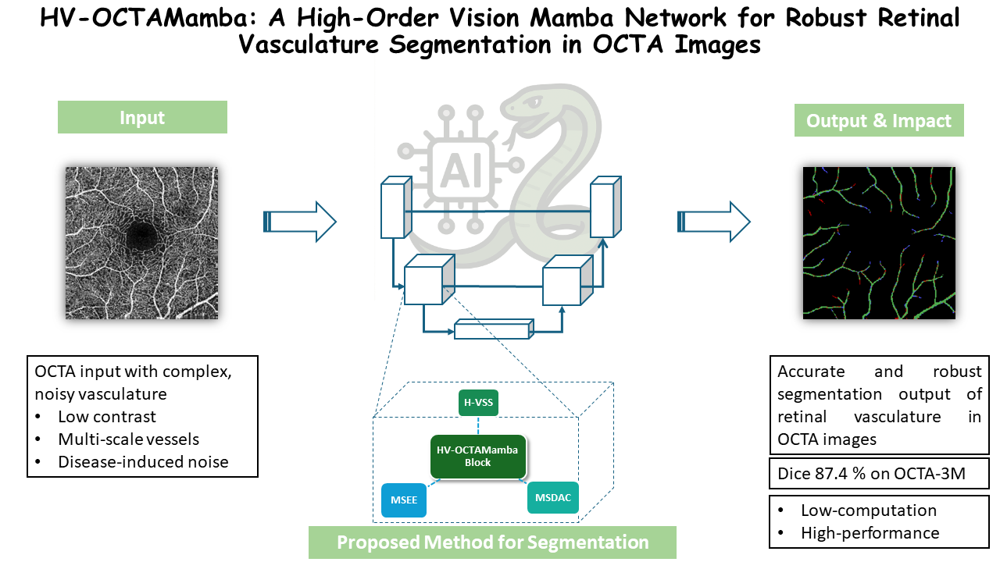
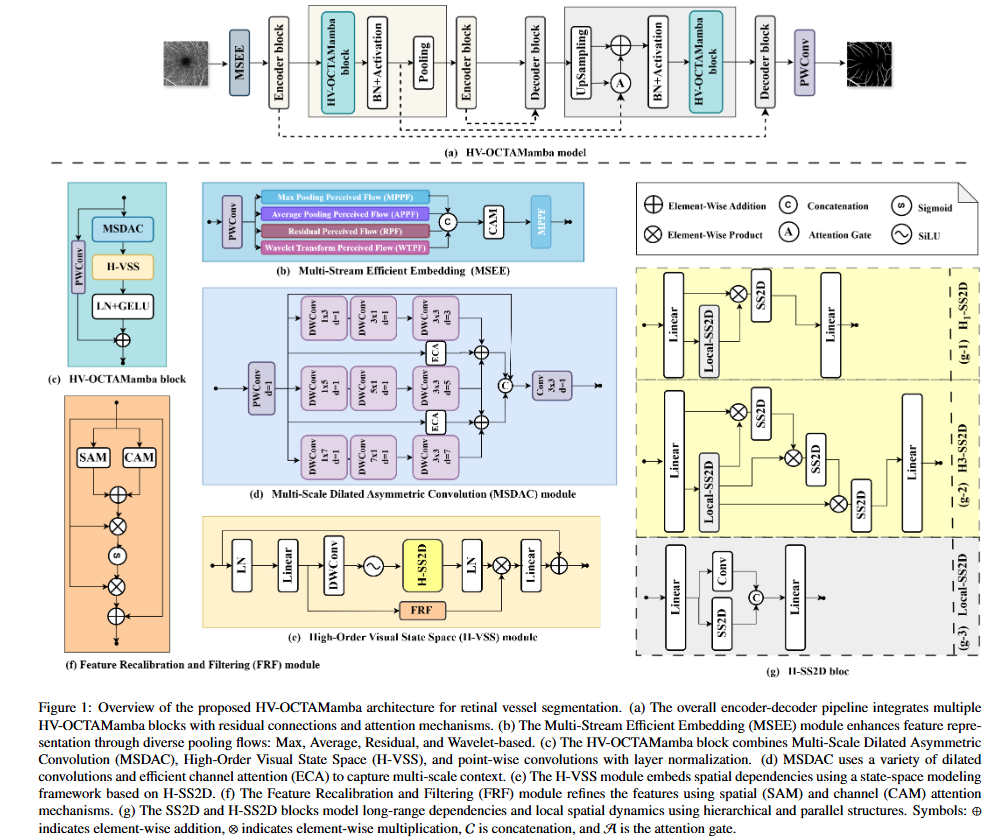
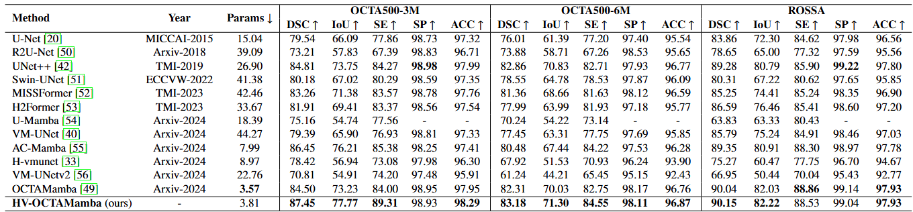
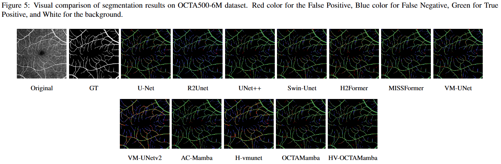

<div align="center">
  <h3>HV-OCTAMamba</h3>
  <p>
    <a href="https://arxiv.org/">[Paper]</a> •
    <a href="https://github.com/acvai/HV-OCTAMamba/">[Project Page]</a>
  </p>
</div>

---

## 🧠 Abstract

<p align="center">
  
</p>
---
The imaging technique called optical coherence tomography angiography (OCTA) has been used extensively in ophthalmology to identify eye conditions such as aged-macular degeneration, vascular oclusion or diabetic retinopathy. However, the multi-scale vascular architecture and noise from low image quality and eye diseases make it difficult to precisely segment the vasculature. In order to accurately segment the vasculature in OCTA, we introduced HV-OCTAMamba, a novel U-shaped network based on the Vision Mamba architecture. HV-OCTAMamba inspired from the state-of-the-art models OCTAMamba and H-vmunet, integrates a Multi-Stream Efficient Embedding Module to extract local features, a Multi-Scale Dilated Asymmetric Convolution Module for multi-scale vasculature capturing, a Feature Recalibration and Filtering Module to filter noise and highlight target areas, and the core component High-Order Visual State Space (H-VSS) which gradually reduces the introduction of redundant information through higher-order interactions during SS2D operations. Our approach is appropriate for low-computation medical applications since it efficiently extracts the global and local features while preserving linear complexity. Extensive tests on the OCTA 3M, OCTA 6M, and ROSSA datasets showed that HV-OCTAMamba performs better than the most advanced methods in the state-of-the-art, offering a new benchmark for effective OCTA segmentation. Notably, HV-OCTAMamba achieved Dice coefficients of 87.45%, 83.18%, and 90.15% on the OCTA 3M, OCTA 6M, and ROSSA datasets, respectively. You may get the code at [HV-OCTAMamba code](https://github.com/acvai/HV-OCTAMamba/).


## 📋 Overview

<p align="center">
  
</p>

---

## 📊 Quantitative Results

<div align="center">
  
</div>

---

## 🎨 Qualitative Visualization

<div align="center">
  
</div>

---

## 💎 Getting Started

### A. Installation

> **Note:** This codebase is tested on **Linux**. Functionality on other operating systems is not guaranteed.

This repository builds upon the [OCTAMamba](https://github.com/zs1314/OCTAMamba) implementation, itself inspired by [VMamba](https://github.com/MzeroMiko/VMamba). Please follow the steps below for setup.

#### 1. Clone the Repository

```bash
git clone https://github.com/acvai/HV-OCTAMamba.git
cd HV_OCTAMamba
```

#### 2. Environment Setup

Create a new Conda environment and install the required dependencies:

```bash
conda create -n hvoctamamba python=3.8
conda activate hvoctamamba
pip install -r requirements.txt
cd kernels/selective_scan && pip install .
```

if creating anaconda env from `environment.yml` (this option might not work in every PC)
```bash
conda env create -f environment.yml
```


### `B. Data Preparation`

To use your own dataset, modify the `prepareDatasets()` function in `datasets.py`:

```bash
def prepareDatasets():
    all_datasets = {}
    
    # Add your datasets here
    # ......

    return all_datasets
```
#### Exprected Directory Structure: 
```bash
--root
  └── dataset
      └── YourDataset
          ├── train
          │   ├── image
          │   └── label
          ├── val
          └── test
```

Each of `train`, `val`, and `test` folders should follow this format:

```bash
--train
  ├── image/
  └── label/

```
#### Preformatted Datasets:
This project supports OCTA500_3M, OCTA500_6M, and ROSSA, structured similarly.
[Download Datasets from Google Drive](https://drive.google.com/drive/folders/1YIOUkL1j4LOjK41An623tHXyCffH5g8o?usp=sharing)


###  `C. Model Training and Testing`
To train or evaluate a model, update the `models` dictionary in `settings_benchmark.py`:
```bash
models = {
    # Add your models here
}

```
Each model should be an instance of `ObjectCreator`.


#### Available Configuration: 
- 11 Models
- 3 Datasets: `ROSSA`, `OCTA_500 (3M)`, and `OCTA_500 (6M)`
To run benchmarks on all model-dataset combinations (total 33 experiments), run:
```bash
python run_benchmark_wo_DataAugment.py 
# or run benchmark with data augmentation: 
python run_benchmark_w_DataAugment.py 
```

> ⚠️: Make sure to configure all necessary parameters before execution.

Results will be stored in the `results/` directory in `.json` format.

###  `D. Pretrained Weights`
Download the pretrained HV-OCTAMamba weights here:
📥[Model Weights Google Drive](https://drive.google.com/drive/folders/1aPyvn95GyVCG4W6REdC8M-xtU1D6zg_a?usp=sharing)

###  `E. Inference`
To run predictions:
```bash
# make the predictions of all models:
python predict_all.py
# predictions of one model only (takes less time computing)
python predict_one.py
```

## 🤝Acknowledgments

This work is built upon:

- OCTAMamba ([paper](https://arxiv.org/abs/2409.08000), [code](https://github.com/zs1314/OCTAMamba)), that is inspired from VMamba 
- VMamba ([paper](https://arxiv.org/abs/2401.10166), [code](https://github.com/MzeroMiko/VMamba)).
We are grateful for their contributions !!!

## 🙋Q & A
Feel free to open an issue or contact the authors with questions.


## 📜Reference
If you find this project helpful, please consider citing our paper and giving this repository a ⭐️.


```
@article{mansouri2025hv-octamamba,
  title={HV_OCTAMamba:Medical Segmentation Model},
  author={Mansouri et al.},
  journal={Coputers in Biology and Medicine},
  year={2025}
}
```


