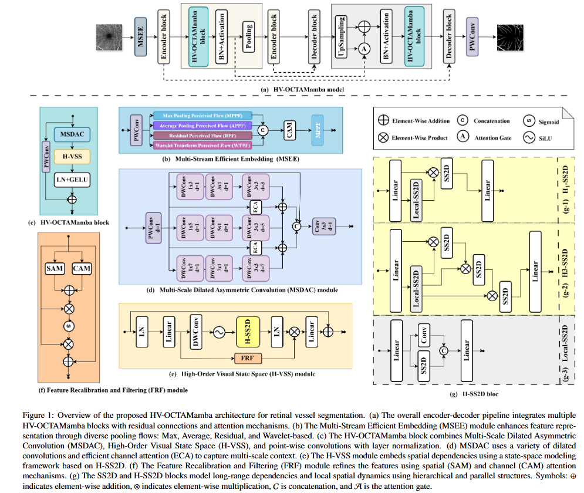

<div align="center">

<h3>HV_OCTAMamba</h3>

[[`Paper`](https://arxiv.org/)] 
[[`Project Page`](https://github.com/acvai/HV-OCTAMamba/)]

</div>

## Abstract
<p align="center">
  
</p>

## Overview
<p align="center">
  
</p>

## Quantitative results
<div align="center">

</div>

## Qualitative visualization 
<div align="center">

</div>

---

## 💎Let's Get Started!

### `A. Installation`

Note that the code in this repo runs under **Linux** system. We have not tested whether it works under other OS.

The repo is based on the [OCTAMamba repo](https://github.com/zs1314/OCTAMamba?tab=readme-ov-file) that is inspired from [VMama repo](https://github.com/MzeroMiko/VMamba), thus you need to install it first. The following installation sequence is taken from the VMamba repo. 

**Step 1: Clone the repository:**

Clone this repository and navigate to the project directory:

```bash
git clone https://github.com/acvai/HV-OCTAMamba.git
cd HV_OCTAMamba
```


**Step 2: Environment Setup:**

It is recommended to set up a conda environment and installing dependencies via pip. Use the following commands to set up your environment:

***Create and activate a new conda environment***

```bash
conda create -n hvoctamamba
conda activate hvoctamamba
```

***Install dependencies***

```bash
pip install -r requirements.txt
cd kernels/selective_scan && pip install .
```

### `B. Data Preparation`

If you want to run your own dataset, you can configure it in `datasets.py`, in function `prepareDatasets`:
```
def prepareDatasets():
    all_datasets = {}
    
    // Add your datasets here
    // ......

    return all_datasets
```
Note that your dataset should follow the given structure:
```
--root
    --dataset
        |
        |--Your Dataset
            |
            |--train
            |--val
            |--test
```
where each folder in `train`, `val`, `test` should follow the given format:( take `train` as an example)
```
--train
    |
    |--image
    |    |
    |    |--......(images)
    |    |--......
    |    |.......
    |--label
        |
        |--......(labels)
        |--......
        |......
```

The OCTA500_3M, OCTA500_6M and ROSSA datasets are formatted as follows:

```
--root
    --dataset
        |
        |--OCTA500_3M
            |
            |--train
            |    |
            |    |--image
            |    |    |--......(images)
            |    |    |--......
            |    |    |.......
            |    |--label
            |        |--......(labels)
            |        |--......
            |        |......
            |--val
            |--test
        |--OCTA500_6M
        |--ROSSA
```

You can download the dataset from here: [Google Drive](https://drive.google.com/drive/folders/1YIOUkL1j4LOjK41An623tHXyCffH5g8o?usp=sharing)

###  `C. Model Training and Testing`

If you want to run your own model, please modify the `models` variable in `settings_benchmark.py`:

```
models = {
    # More models can be added here......
}
```
Each item in `models` must be of type `ObjectCreator`, in which your model can be created.

The current version of the code contains 11 models, and 3 datasets: `ROSSA`, `OCTA_500 (3M)` and `OCTA_500 (6M)`.

By running `run_benchmark.py`, the 11 models on 3 datasets will be trained and evaluated at once (that is, a total of 11x3=33 results).

The results will be saved in `json` format to the `result` folder.

```bash
python run_benchmark.py
```

🐥: Before training and testing, configure the relevant parameters in the script

###  `D. Get model weights`
You can download the model weights (HV-OCTAMamba) from here: [Google Drive](https://drive.google.com/drive/folders/1aPyvn95GyVCG4W6REdC8M-xtU1D6zg_a?usp=sharing)

###  `E. Model Predict`
```bash
python predict.py
```

## 🤝Acknowledgments

This project is based on OCTAMamba ([paper](https://arxiv.org/abs/2409.08000), [code](https://github.com/zs1314/OCTAMamba)) that is inspired from VMamba ([paper](https://arxiv.org/abs/2401.10166), [code](https://github.com/MzeroMiko/VMamba)). Thanks for their excellent works!!

## 🙋Q & A


## 📜Reference

If this code or paper contributes to your research, please kindly consider citing our paper and give this repo ⭐️ 🌝

```
@article{mansouri2025hv-octamamba,
  title={HV_OCTAMamba:Medical Segmentation Model},
  author={Mansouri, Amine},
  journal={Coputers in Biology and Medicine},
  year={2025}
}
```


