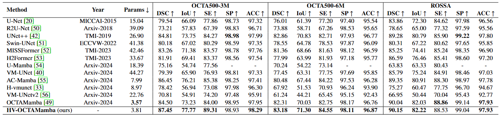
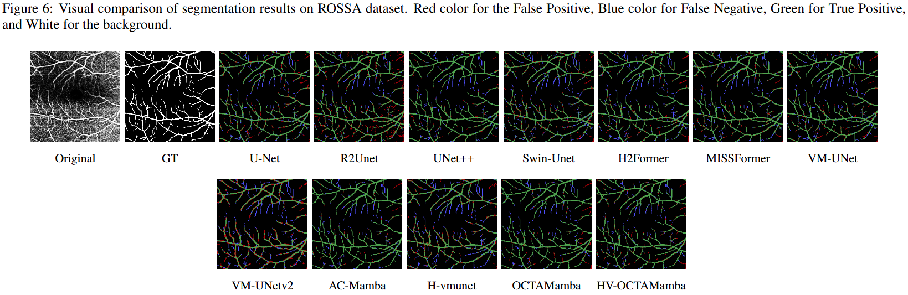

<div align="center">
  
  <h3>HV_OCTAMamba</h3>
  <p>
    <a href="https://arxiv.org/">[Paper]</a> •
    <a href="https://github.com/acvai/HV-OCTAMamba/">[Project Page]</a>
  </p>
</div>

---

## 🧠 Abstract

<p align="center">
  
</p>

---

## 📋 Overview

<p align="center">
  
</p>

---

## 📊 Quantitative Results

<div align="center">
  
</div>

---

## 🎨 Qualitative Visualization

<div align="center">
  
</div>

---

## 💎 Getting Started

### A. Installation

> **Note:** This codebase is tested on **Linux**. Functionality on other operating systems is not guaranteed.

This repository builds upon the [OCTAMamba](https://github.com/zs1314/OCTAMamba) implementation, itself inspired by [VMamba](https://github.com/MzeroMiko/VMamba). Please follow the steps below for setup.

#### 1. Clone the Repository

```bash
git clone https://github.com/acvai/HV-OCTAMamba.git
cd HV_OCTAMamba


**Step 2: Environment Setup:**

Create a new Conda environment and install the required dependencies:

```bash
conda create -n hvoctamamba python=3.8
conda activate hvoctamamba
pip install -r requirements.txt
cd kernels/selective_scan && pip install .
```


### `B. Data Preparation`

To use your own dataset, modify the `prepareDatasets()` function in `datasets.py`:

```bash
def prepareDatasets():
    all_datasets = {}
    
    # Add your datasets here
    # ......

    return all_datasets
```
#### Exprected Directory Structure: 
```bash
--root
  └── dataset
      └── YourDataset
          ├── train
          │   ├── image
          │   └── label
          ├── val
          └── test
```

Each of `train`, `val`, and `test` folders should follow this format:

```bash
--train
  ├── image/
  └── label/

```
#### Preformatted Datasets:
This project supports OCTA500_3M, OCTA500_6M, and ROSSA, structured similarly.
[Download Datasets from Google Drive](https://drive.google.com/drive/folders/1YIOUkL1j4LOjK41An623tHXyCffH5g8o?usp=sharing)


###  `C. Model Training and Testing`
To train or evaluate a model, update the `models` dictionary in `settings_benchmark.py`:
```bash
models = {
    # Add your models here
}

```
Each model should be an instance of `ObjectCreator`.


#### Available Configuration: 
- 11 Models
- 3 Datasets: `ROSSA`, `OCTA_500 (3M)`, and `OCTA_500 (6M)`
To run benchmarks on all model-dataset combinations (total 33 experiments), run:
```bash
python run_benchmark_wo_DataAugment.py 
# or run benchmark with data augmentation: 
python run_benchmark_w_DataAugment.py 
```

⚠️: Make sure to configure all necessary parameters before execution.

Results will be stored in the `results/` directory in `.json` format.

###  `D. Pretrained Weights`
Download the pretrained HV-OCTAMamba weights here:
📥[Model Weights Google Drive](https://drive.google.com/drive/folders/1aPyvn95GyVCG4W6REdC8M-xtU1D6zg_a?usp=sharing)

###  `E. Inference`
To run predictions:
```bash
# make the predictions of all models:
python predict_all.py
# predictions of one model only (takes less time computing)
python predict_one.py
```

## 🤝Acknowledgments

This work is built upon:

- OCTAMamba ([paper](https://arxiv.org/abs/2409.08000), [code](https://github.com/zs1314/OCTAMamba)), that is inspired from VMamba 
- VMamba ([paper](https://arxiv.org/abs/2401.10166), [code](https://github.com/MzeroMiko/VMamba)).
We are grateful for their contributions !!!

## 🙋Q & A
Feel free to open an issue or contact the authors with questions.


## 📜Reference
If you find this project helpful, please consider citing our paper and giving this repository a ⭐️.


```
@article{mansouri2025hv-octamamba,
  title={HV_OCTAMamba:Medical Segmentation Model},
  author={Mansouri et al.},
  journal={Coputers in Biology and Medicine},
  year={2025}
}
```


